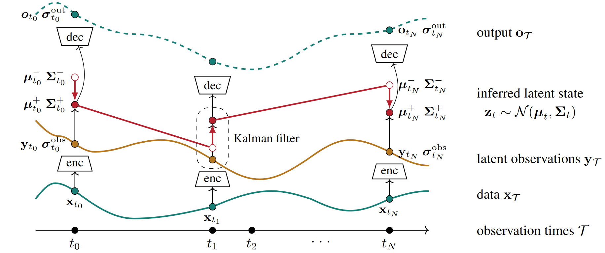

# Modeling Irregular Time Series with Continuous Recurrent Units (CRUs)

This repository contains the PyTorch implementation for the paper [Modeling Irregular Time Series with Continuous Recurrent Units](https://arxiv.org/pdf/2111.11344.pdf) by [Mona Schirmer](https://monasch.github.io/), [Mazin Eltayeb](https://www.linkedin.com/in/mazin-eltayeb-199a6a18), [Stefan Lessmann](https://www.wiwi.hu-berlin.de/en/Professorships/bwl/wi/personen-en/hl/standardseite-en) and [Maja Rudolph](http://maja-rita-rudolph.com/) published at ICML 2022.
>Schirmer, M., Eltayeb, M., Lessmann, S., & Rudolph, M. (2022, June). Modeling irregular time series with continuous recurrent units. In International Conference on Machine Learning (pp. 19388-19405). PMLR.
<p align="center">
  
</p>

## Prerequisites
The code uses Python3 and PyTorch as auto-differentiation package. To set up an environment with the required packages, run
```
conda create -n cru python=3.9.7
conda activate cru
pip install -r requirements.txt
```


## Training and Evaluation
By default, datasets are generated or downloaded and processed when run the first time. 

 - Pendulum interpolation 
```
python run_experiment.py --dataset pendulum --task interpolation -lsd 30 --sample-rate 0.5 --impute-rate 0.5
```

 - Pendulum regression 
```
python run_experiment.py --dataset pendulum --task regression -lsd 30 --sample-rate 0.5
```

 - USHCN interpolation 
```
python run_experiment.py --dataset ushcn --task interpolation -lsd 10 --ts 0.3 --sample-rate 0.5 --unobserved-rate 0.2 --enc-var-activation square --dec-var-activation exp --trans-var-activation relu --grad-clip
```

 - USHCN extrapolation
```
python run_experiment.py --dataset ushcn --task extrapolation -lsd 10 --ts 0.3 --sample-rate 0.5 --unobserved-rate 0.2 --enc-var-activation square --dec-var-activation exp --trans-var-activation relu --grad-clip
```

 - Physionet interpolation
```
python run_experiment.py --dataset physionet --task interpolation -lsd 20 --ts 0.2 --enc-var-activation square --dec-var-activation exp --trans-var-activation relu --grad-clip --num-basis 20 --bandwidth 10 
```

 - Physionet extrapolation 
```
python run_experiment.py --dataset physionet --task extrapolation -lsd 20 --ts 0.2 --enc-var-activation square --dec-var-activation exp --trans-var-activation relu --grad-clip --num-basis 20 --bandwidth 10 --cut-time 24
```

## Running different models

 - CRU
```
python run_experiment.py --dataset pendulum --task regression -lsd 30 --sample-rate 0.5
```

 - f-CRU
```
python run_experiment.py --dataset pendulum --task regression -lsd 30 --sample-rate 0.5 --f-cru --lr 5e-3
```

 - RKN
```
python run_experiment.py --dataset pendulum --task regression -lsd 30 --sample-rate 0.5 --rkn 
```

 - RKN-Delta-t
```
python run_experiment.py --dataset pendulum --task regression -lsd 30 --sample-rate 0.5 --rkn --t-sensitive-trans-net
```


## Acknowledgements and References
The CRU builts on the repository of RKN by Becker et al. (2019):

[Becker, P., Pandya, H., Gebhardt, G., Zhao, C., Taylor, C. J., and Neumann, G. (2019). Recurrent kalman networks: Factorized inference in high-dimensional deep feature spaces. In International Conference on Machine Learning, pages 544-552. PMLR.](https://arxiv.org/pdf/1905.07357.pdf)

Preprocessing of USHCN has been adapted from Brouwer et al. (2019):

[Brouwer, E. D., Simm, J., Arany, A., and Moreau, Y. (2019). Gru-ode-bayes: continuous modeling of sporadically-observed time series. In Proceedings of the 33rd International Conference on Neural Information Processing Systems, pages 7379-7390.](https://github.com/edebrouwer/gru_ode_bayes)

Preprocessing of Physionet has been adapted from Rubanova et al. (2019):

[Rubanova, Y., Chen, R. T., and Duvenaud, D. Latent odes for irregularly-sampled time series. In Advances in Neural Information Processing Systems, pp. 5320–5330, 2019](https://github.com/YuliaRubanova/latent_ode)

## License

Modeling Irregular Time Series with Continuous Recurrent Units (CRUs) is open-sourced under the AGPL-3.0 license. See the
[LICENSE](LICENSE) file for details.

For a list of other open source components included in Modeling Irregular Time Series with Continuous Recurrent Units (CRUs), see the
file [3rd-party-licenses.txt](3rd-party-licenses.txt).